# Git – Project with Local Machine & Remote Repository
# Meguellati Wassim 

This guide demonstrates how to work with a Git project using a local machine and a remote repository (GitHub/GitLab).

---

## Steps

### a) Create a Remote Repository
Create a new repository on GitHub or GitLab (e.g., `Software_developement_tools_report`).

---

### b) Clone the Empty Repository

```bash
git clone https://github.com/WassimMgg/Software_developement_tools_report.git
```

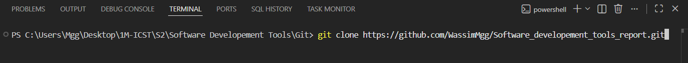

After running the command, Git clones the remote repository to your local machine:

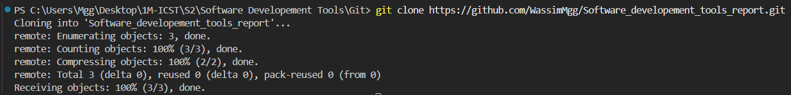

---

### c) Create a Project in the Local Repo Folder

Navigate into the cloned folder and create your project files using your chosen programming language (Python, Java, C++, C#, etc.).

```bash
cd Software_developement_tools_report
```

---

### d) Commit the Whole Project to the Repo

Stage all files and make the first commit:

```bash
git add .
git commit -m "Add main.py to my github repo"
```

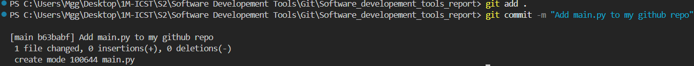

---

### e) Add Simple Code (e.g., Create a Calculator)

Write some initial code — for example, a simple calculator — and commit it:

```bash
git add main.py
git commit -m "Create a Simple Calculator"
```

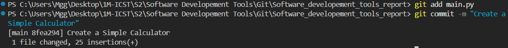

---

### f) Commit Changes

After adding more functionality (e.g., a results table to store all operations), stage and commit again:

```bash
git add main.py
git commit -m "Added a list (results_table) to store all operations"
```

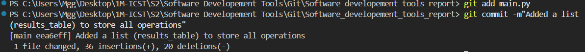

---

### g–h) Add More Code & Commit

Continue developing the application (e.g., enhance the calculator into a small application) and commit:

```bash
git add main.py
git commit -m "Enhance this Calculator to a small application"
```

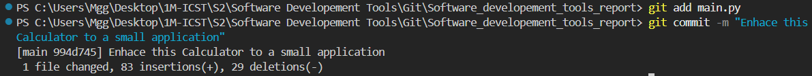

---

### i–j) Add More Code & Commit

Keep improving the project with additional features and commit each meaningful change with a descriptive message.

---

### k) View Commit History

Use `git log` to inspect the full history of commits:

```bash
git log
```

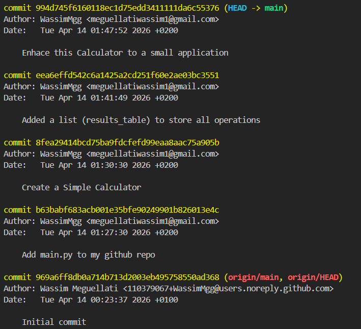

The log shows all commits in reverse chronological order, including:
- **HEAD → main** — the current local state
- **origin/main, origin/HEAD** — the last known state of the remote

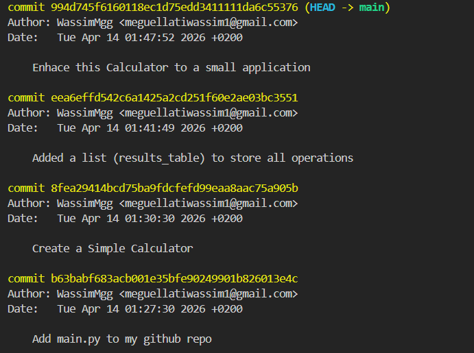

---

### l) View Code Annotations (git blame)

`git blame` shows who last modified each line of a file and in which commit. This is useful for understanding the history of specific lines of code.

```bash
git blame main.py
```

Each line is prefixed with the commit hash, author name, and timestamp:

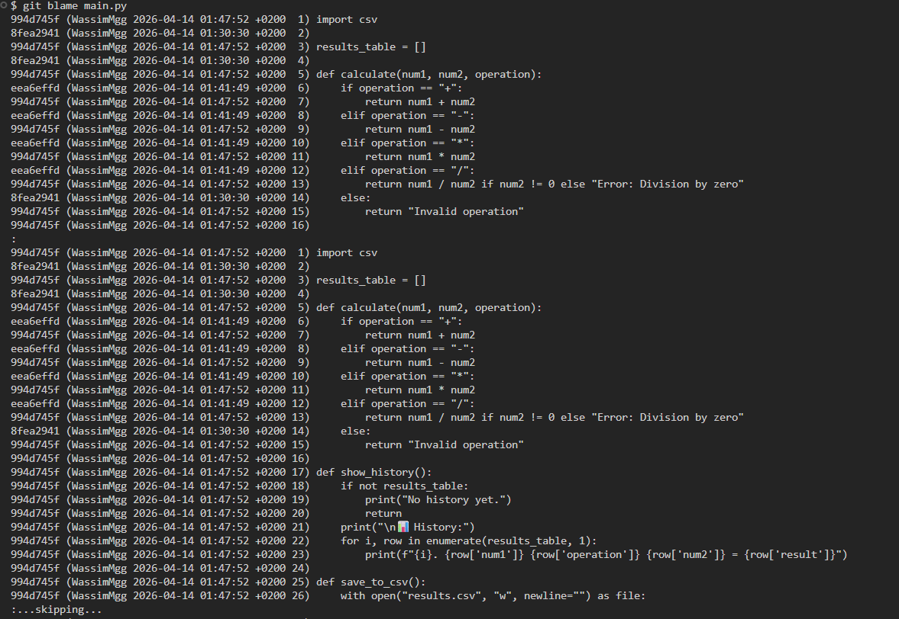

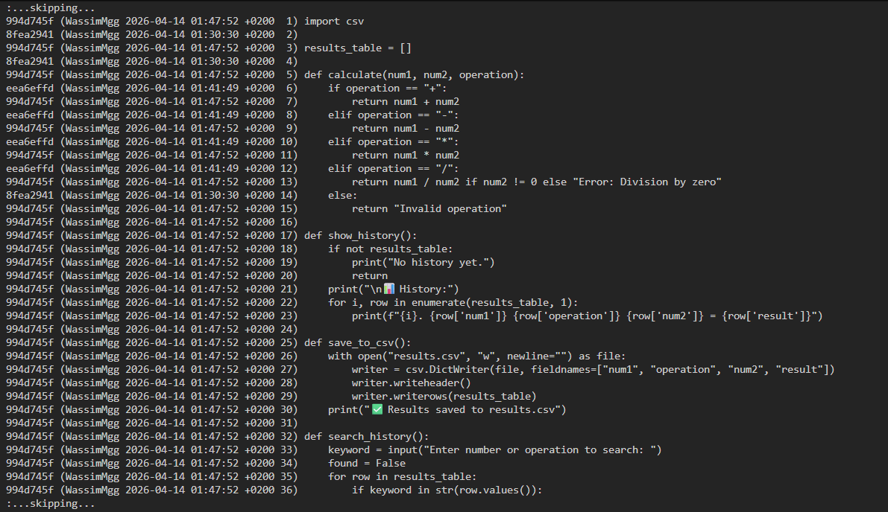

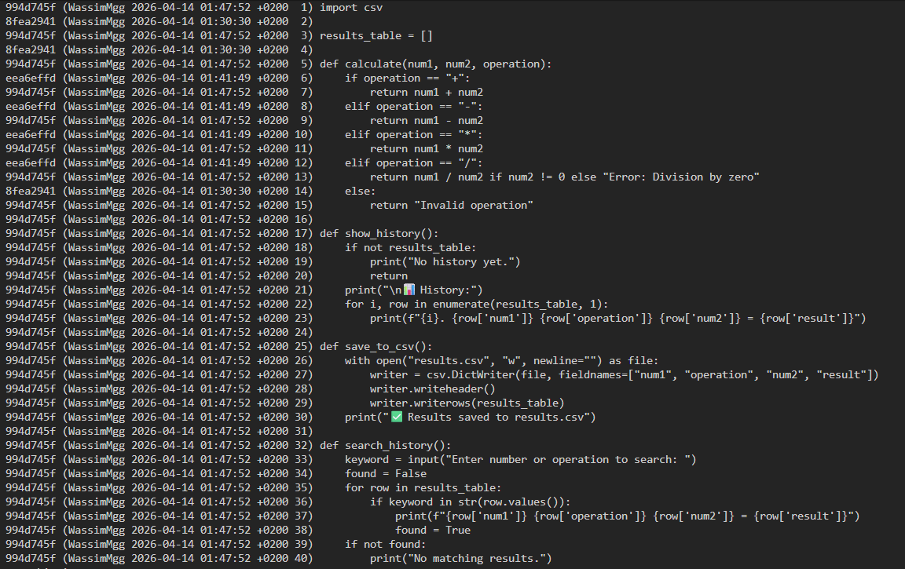

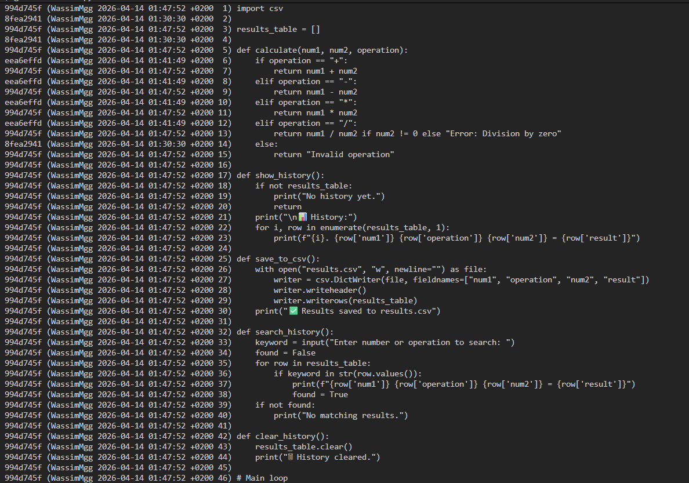

In the output you can see that different lines were introduced in different commits (`994d745f`, `eea6effd`, `8fea2941`), making it easy to trace the origin of each piece of code.

---

### m–n) Make Changes Without Committing

Add new code to the project (e.g., add a line to tell the user to choose a valid option from the menu), but **do not commit** yet:

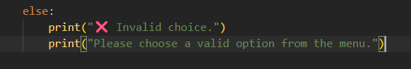

---

### o) Revert the Last Changes (git revert)

If a `git revert` fails because of uncommitted local changes, Git will warn you first:

```bash
git revert 994d745f6160118ec1d75edd3411111da6c55376
```

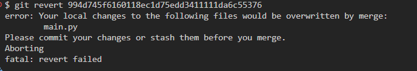

After committing or stashing the local changes, the revert can proceed. Git opens an editor to confirm the revert commit message:

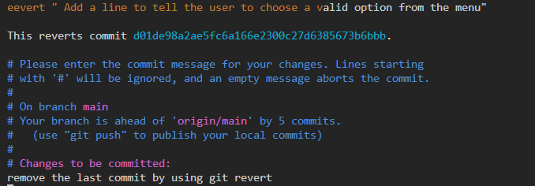

---

### p) Push the Project to the Remote Repo (git push)

Once all local commits are ready, push them to the remote repository:

```bash
git push
```

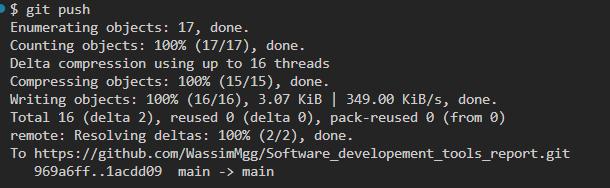

---

### r) Delete the Local Project and Local Repo

To simulate starting fresh, delete the local project folder entirely:

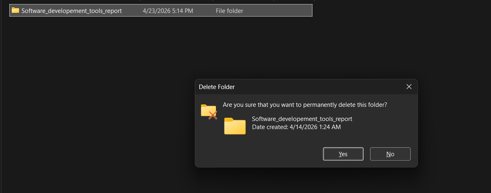

---

### s) Clone the Project from the Remote Repo (git clone)

Re-clone the repository from GitHub to restore the project locally:

```bash
git clone https://github.com/WassimMgg/Software_developement_tools_report.git
```

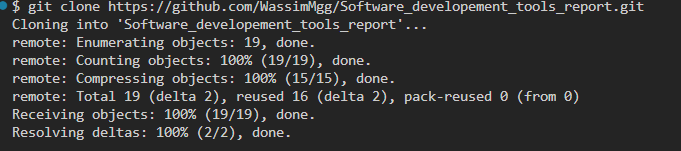

---

### t) Create a Tag / Release (git tag)

Tags mark specific points in history as important — typically used for releases. Create an annotated tag and push it to the remote:

```bash
git tag -a v1.0 -m "Report Release version 1.0"
git tag
git push origin v1.0
```

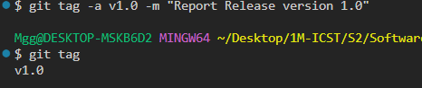

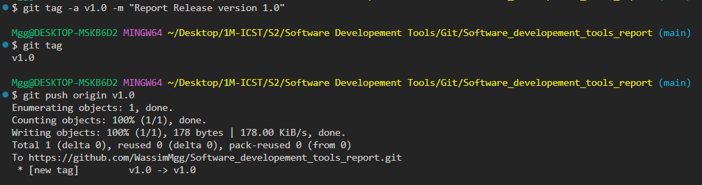

---

### u) Create a New Branch from Main

First, confirm the current branches, then create a new branch:

```bash
git branch
```

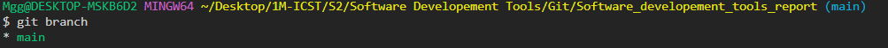

A new branch (e.g., `new_branch`) can then be created with:

```bash
git branch new_branch
git switch new_branch
```

---

### w) Switch to the New Branch (git switch / git checkout)

Switch to the newly created branch to start working on it independently:

```bash
git switch new_branch
# or equivalently:
git checkout new_branch
```

---

### x) Improve Code in the Branch

Make improvements to the code while on `new_branch` (e.g., refactor the calculator, change an algorithm, add features), then commit those changes to the branch.

---

### y) Merge the New Branch into Main (git merge)

Switch back to `main`, pull the latest changes, then merge `new_branch` into it:

```bash
git switch main
git pull origin main
git merge new_branch
git push
```

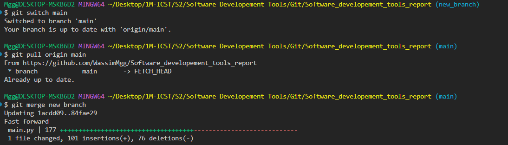

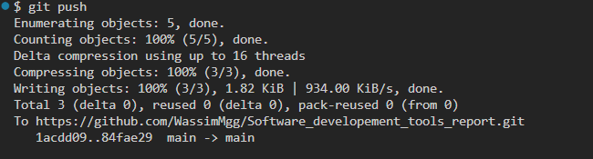

The fast-forward merge updates `main` with all the commits from `new_branch` (`1 file changed, 101 insertions(+), 76 deletions(-)`).

---

## Summary of Commits

| Commit Hash (short) | Message                                           | Date                  |
|---------------------|---------------------------------------------------|-----------------------|
| `994d745`           | Enhance this Calculator to a small application    | Tue Apr 14 01:47 2026 |
| `eea6eff`           | Added a list (results_table) to store all operations | Tue Apr 14 01:41 2026 |
| `8fea294`           | Create a Simple Calculator                        | Tue Apr 14 01:30 2026 |
| `b63babf`           | Add main.py to my github repo                     | Tue Apr 14 01:27 2026 |
| `969a6ff`           | Initial commit                                    | Tue Apr 14 00:23 2026 |

---

## Key Git Commands Used

```bash
git clone <url>               # Clone a remote repository locally
git add <file>                # Stage a file for commit
git add .                     # Stage all changed files
git commit -m "message"       # Commit staged changes with a message
git log                       # View full commit history
git blame <file>              # Show who changed each line and when
git revert <commit-hash>      # Create a new commit that undoes a previous one
git push                      # Push local commits to the remote repository
git push origin <tag>         # Push a tag to the remote
git tag -a <tag> -m "msg"     # Create an annotated tag
git tag                       # List all tags
git branch                    # List all branches
git branch <name>             # Create a new branch
git switch <branch>           # Switch to a branch
git checkout <branch>         # Switch to a branch (older syntax)
git merge <branch>            # Merge a branch into the current one
git pull origin <branch>      # Fetch and merge from remote
```

---

> **Author:** WassimMgg  
> **Repository:** [Software_developement_tools_report](https://github.com/WassimMgg/Software_developement_tools_report)
